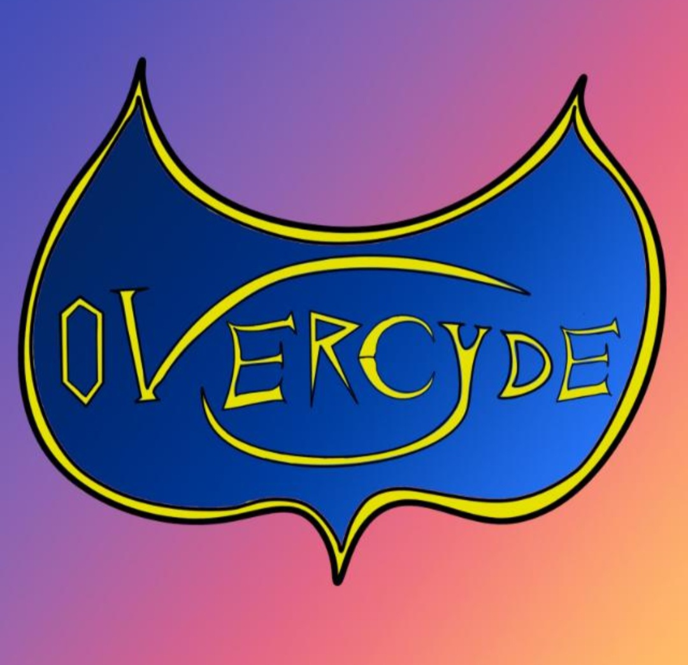
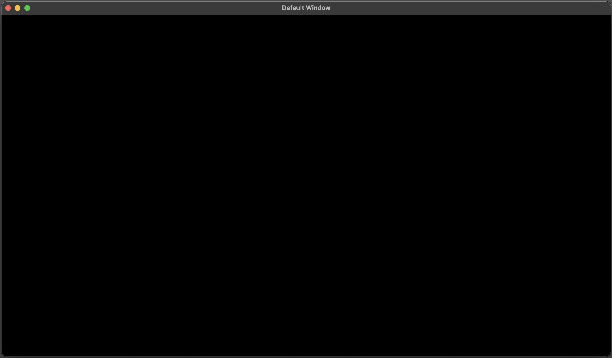
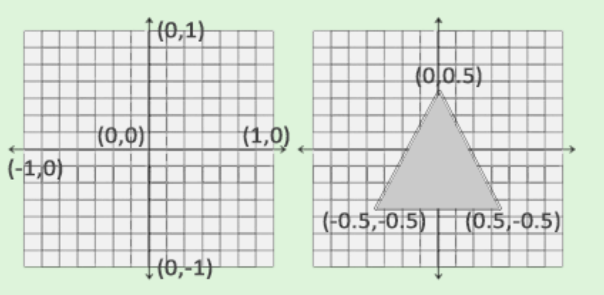
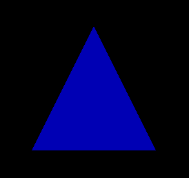
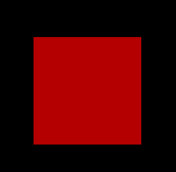
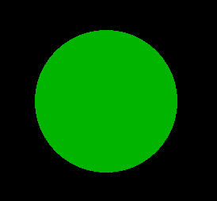
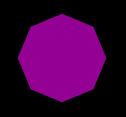

# OverCyde Engine (not official name)
Game engine made from scratch in c++ with OpenGL to support the deployment of the game <b>OverCyde</b>. 
<div></div>

## Installation

First you have to clone the reposiory with submodules (i suggest forking the repo to simplify your work):
```
git clone --recurse-submodules https://github.com/bigmat18/OverCyde.git
```

The repository has the following dependecies:
- [GLFW](https://github.com/glfw/glfw): contains .dll, .dylib and .h files
- [glew](https://github.com/nigels-com/glew): contains .dll, .dylib and .h files
- [glm](https://github.com/g-truc/glm): contains .hpp files (sub-repo)
- [spdlog](https://github.com/gabime/spdlog): contains .cpp and .hpp files (sub.repo)
- [stb_image](https://github.com/nothings/stb/blob/master/stb_image.h): contains the stb_image.h file
</br>
</br>

## Building

### Using makefile (recommended)
Build **all the project** (engine and game):
```
make buid_all
```
> **_NOTE:_**  Use this when you work with the engine and game at the same time.

Build only the **engine** (this ceate .dylib or .dll):
```
make buid_engine
```
> **_NOTE:_**  Use this when you work with the only engine.

Build only the **game**:
```
make buid_game
```
> **_NOTE:_**  Use this when you work with the only the game.

</br>

### Using python script
Build **all the project** (engine and game):
```
python ./build.py engine && python ./build.py game 
```
> **_NOTE:_**  Use this when you work with the engine and game at the same time.

Build only the **engine** (this ceate .dylib or .dll):
```
python ./build.py engine
```
> **_NOTE:_**  Use this when you work with the only engine.

Build only the **game**:
```
python ./build.py game
```
> **_NOTE:_**  Use this when you work with the only the game.

</br>

## Quick start guide
In src/Game/Game.cpp there is the base file of the game. First, import the main libraries:
```c++
#define ENGINE_PLATFORM
#include <Engine.h>
#include <EntryPoint.h>
```
- ```#include <Engine.h>``` import all the Engine modules.
- ```#include <EntryPoint.h>``` in this file there's the procedure to start application.

> **_WARN:_** ```#define ENGINE_PLATFORM``` is necessary to start the Engine without issues.

After that you can create your Application class in the following way:
```c++
class Game : public Engine::Application {  
    friend class Engine::Application;
};
```
In the class you have to declare _Engine::Application_ as a [friend class](https://cplusplus.com/doc/tutorial/inheritance/#google_vignette) to access its protected methods.<br/>
Then, in your class you have to create the [constructor](https://learn.microsoft.com/en-us/cpp/cpp/constructors-cpp?view=msvc-170) to execute operations like adding layers when the Game instance is created.
```c++
// ...
private:
    Game() : Engine::Application() {}
// ...
```
> **_NOTE:_** You must set the constructor as private because the Application class (and sub-classes) are [Singleton Classes](https://it.wikipedia.org/wiki/Singleton_(informatica)).

Now, for the most important part to start your application, you have define the Application::Create() function outside your class in the following way:
```c++
Engine::Application* Engine::Application::Create() {
    /* Execute code...*/
    return Engine::Application::SetInstance(new Game());
}
```
In this function you can execute the pre-creation instance scripts and than call the ```Engine::Application::SetInstance()``` to setup the Application, and pass your Application class' instance.

You can now [build](##Building) the code and execute it with
```
make run
```
or
```
./bin/main.exe
```
and should see this black window:
<div></div>

The Background color, title, height and width can be changed using the ApplicationProps [struct](https://learn.microsoft.com/it-it/cpp/cpp/struct-cpp?view=msvc-170). </br>
Example:

```c++
class Game : public Engine::Application {  
    friend class Engine::Application;

    private:
        Game(const Engine::ApplicationProps& props) : Engine::Application(props) {
            this->PushLayer(new GameLayer());
        }
};

Engine::Application* Engine::Application::Create() {
    Engine::ApplicationProps props = Engine::ApplicationProps();
    props.WProps.Title = "Game";
    props.WProps.Width = 720;
    props.WProps.Height = 720;
    props.BGColor = Vec4f(HEX_COLOR(0xBF00FFFF));

    return Engine::Application::SetInstance(new Game(props));
}
```
> **_NOTE:_** the ```props.BGColor``` is a Vec4f(r, g, b, a). ```HEX_COLOR``` converts a 32bit integer to (r, g, b, a) sequence.

## Layers
Layers in a game engine are similar to layers in Photoshop, for example. The layer stack will determine the order in which things are drawn on the screen. Layers in a game engine are also applicable to events and update logic. For example:
- Game layer (Root)
- Debug layer
- UI layer
- Menu layer 
- ecc.

### Create your own layer
To create your own layer you can create a different file, for example MyLayer.h (for .h/.cpp patterns see [this](https://stackoverflow.com/questions/333889/why-have-header-files-and-cpp-files)). In this file include the base Engine dependency and declare your layer that inherits the base Layer class
```c++
class YourLayer : public Engine::Layer {
    public:
        YourLayer() : Layer("Name of your layer") {}
}
```
In this example we have created a custom constructor that call the Layer constructor, takes a parameter that indicates the layer's name (it's only used in debug).

From ```Engine::Layer``` you can override four methods:

#### OnAttach
```c++
// public
void OnAttach() override;
```
This method is called when a Layer is added to the LayerStack. <br/>
For example when base instaces of other classes are created.

#### OnDetach
```c++
// public
void OnDetach() override;
```
This method is called when a Layer is removed from the LayerStack. <br/>
For example when you deallocate all the memory allocated.

#### OnUpdate
```c++
// public
void OnUpdate(float deltaTime) override;
```
This method is called in every iteration of the engine loop, in this method you should write the logic of the layer. <br/>
For example, in a game where the main character is continuously running, inside this method you can calculte his coordinates every frame.

#### OnEvent
```c++
// public
void OnEvent(Event& event) override;
```
This method is called when the events stack is processed: this is the first operation in the [game loop](https://gameprogrammingpatterns.com/game-loop.html). Every layer is called in order and the Application sends events to the OnEvent method. In this method you can write the event callback using the event dispatcer (see the [Events](#events) section).

For example, in a game where the main character can jump when pressing the space key, inside the OnEvent method you can check if the key is pressed and execute a callable function.

### Adding layers to the Application
To add your own layer to Application you can call one of this two methods in the constructor of your custom application class:

#### PushLayer
```c++
PushLayer(new YourLayer());
```
Adds your layer at the bottom of the layer stack.

#### PushOverlay
```c++
PushOverlay(new YourLayer());
```
Adds your layer at the top of the layer stack

## Events
The Application needs to receive events to dispatch them to layers. The Window class can receive these events and communicate with the Application class. Set up a call back function to pass events data to the Application.

The event system is already implemented for application, mouse, key, and window events

To process events you must use the EventDispatcher class. Create an instance, for example, in the OnEvent method inside a [layer](#onevent)
```c++
EventDispatcher dispatcher = EventDispatcher(YourEvent);
```
Where _YourEvent_ is the event to dispatch.<br>
To choose which function processes each event call the ```Dispatch``` method and use ```BIND_FUN``` to execute the binding.
```c++
dispatcher.Dispatch<YourEventType>(BIND_FUN(YourFunction));
```
In this example if the event is of type WindowCloseEvent the dispatch sends it to the OnWindowClose method. this function has this signature:
```c++
bool YourFunction(YourEventType& YourEventName)
```
> **_NOTE:_** When the Dispatcher dispatches events to functions it sets them as Handled, so that no other Dispatcher can handle it.

### Events list
Application events:
- **WindowCloseEvent**: When the window close button is pressed.
- **WindowResizeEvent**: When the window is resized.
- **WindowFocusEvent**: When there is a window focus.
- **WindowLostFocusEvent**: When a window loses its focus.
- **WindowMovedEvent**: When the window is moved.

Key events:
- **KeyEvent**: Generic key event.
- **KeyPressedEvent**: When a key is pressed.
- **KeyReleasedEvent**: When a key is released.
- **KeyTypedEvent**: When a key is typed.

Mouse events:
- **MouseMovedEvent**: When the mouse is moved.
- **MouseScrolledEvent**: When the mouse wheel is scrolled.
- **MouseButtonPressedEvent**: When a mouse button is pressed.
- **MouseButtonReleasedEvent**: When a mouse button is released.

### Key and mouse codes
Key code (list in src/Engine/Events/KeyCode.h file):
```c++
Engine::Key::TheKeyName
```

Mouse code (list in src/Engine/Events/MouseCode.h file):
```c++
Engine::Mouse::TheKeyName
```

## Renderer2D
Renders the 2D graphics on the screen. To initialize the Renderer2D you have to add the following line when initializing the props in the Create function:
```c++
props.RType = Renderer::RendererType::Renderer2D;
```

### Math and trasformations
This is the first step when building the rendering system. Bacause this project aims to have an optmized and fast library, [glm](https://github.com/g-truc/glm) will be used instead of creating our own math library from scratch. 
> **_NOTE:_** the Renderer space is [normalized](https://www.ncl.ucar.edu/Document/Graphics/ndc.shtml) (image below):
<div></div>

> **_NOTE:_** Every system of coordinates is managed with Engine type: Vec2f, Vec3f, Vec4f.
```c++
Engine::Vec2f(0.25f, 0.0f),
Engine::Vec3f(0.125f, 0.125f),
Engine::Vec4f(0.0f, 0.0f, 1.0f, 1.0f),
```
**Example:**
```c++
Engine::Renderer::Draw2DTriangle(Engine::Vec2f(0.25f, 0.0f),
                                 Engine::Vec2f(0.125f, 0.125f),
                                 Engine::Vec4f(0.0f, 0.0f, 1.0f, 1.0f),
                                 45.0f);
```
This example creates a triangle in (x,y) = (0.25f, 0.0f), scales it for (x,y) = (0.125f, 0.125f), the color is (r, g, b, a) = (0.0f, 0.0f, 1.0f, 1.0f) and rotates it of 45.0f.
> **_WARN:_** Every rotation in the renderer are expressed in degrees.

### Draw2DTriangle
Draws a triangle in a 2D space. You can change the position, size, color and rotate the shape.
```c++
void Engine::Renderer::Draw2DTriangle(Vec2f position = Vec2f(0.0f, 0.0f), 
                                      Vec2f size = Vec2f(1.0f, 1.0f), 
                                      Vec4f color = Vec4f(1.0f, 1.0f, 1.0f, 1.0f), 
                                      float degree = 0.0f);
```
<div></div>

### Draw2DSquare
Draw a square in a 2D space. You can change the position, size, color and rotate the shape.
```c++
void Engine::Renderer::Draw2DSquare(Vec2f position = Vec2f(0.0f, 0.0f), 
                                    Vec2f size = Vec2f(1.0f, 1.0f), 
                                    Vec4f color = Vec4f(1.0f, 1.0f, 1.0f, 1.0f), 
                                    float degree = 0.0f);
```
<div></div>

### Draw2DCircle
Draw a circle in a 2D space. You can change the position, radius, color and rotate the shape.
```c++
void Engine::Renderer::Draw2DCircle(float radius = 1.0f,
                                    Vec2f position = Vec2f(0.0f, 0.0f), 
                                    Vec4f color = Vec4f(1.0f, 1.0f, 1.0f, 1.0f), 
                                    float degree = 0.0f);
```
<div></div>

> **_WARN:_** the radius must be positive.

### Draw2DPolyhedron
Draw a polyhedron in a 2D space.
```c++
void Engine::Renderer::Draw2DPolyhedron(ui32 sides,
                                        Vec2f position = Vec2f(0.0f, 0.0f), 
                                        Vec2f size = Vec2f(1.0f, 1.0f), 
                                        Vec4f color = Vec4f(1.0f, 1.0f, 1.0f, 1.0f), 
                                        float degree = 0.0f);
```
<div></div>

> **_WARN:_** the sides param must be greater than or equal to 5.

## Logging
You can use the functions shown below to log events so the engine can communicate with the user. The goal for the application is to be the most client-facing possible. Because of that, it's nice to use a color code to differenciate the severity of the messages. It's also recommended to let know where the log is coming from. Because of the extension of this work, an external library is used for printing messages.
```c++
LOG_CLIENT_TRACE("{0} {1}", var0, var1); // Grey color

LOG_CLIENT_INFO("{0} {1}", var0, var1); // Grean color

LOG_CLIENT_WARN("{0} {1}", var0, var1); // Yellow color

LOG_CLIENT_ERROR("{0} {1}", var0, var1); // Red color

LOG_CLIENT_CRITICAL("{0} {1}", var0, var1); // Dark red color
```